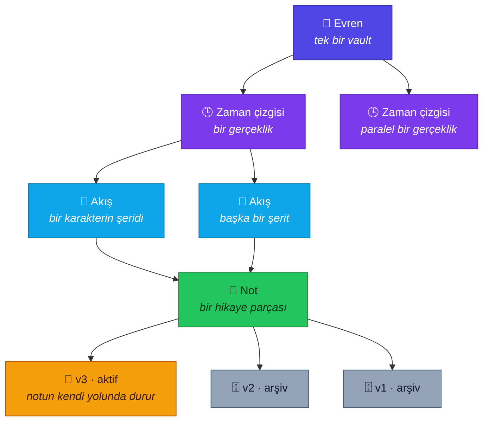
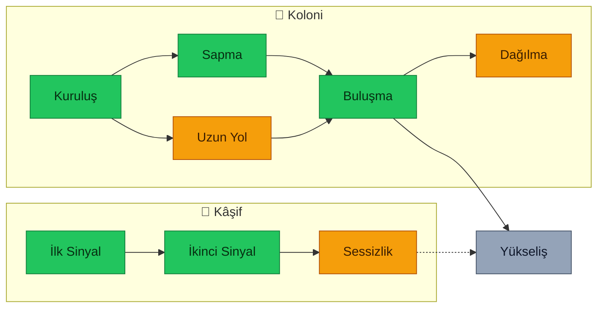
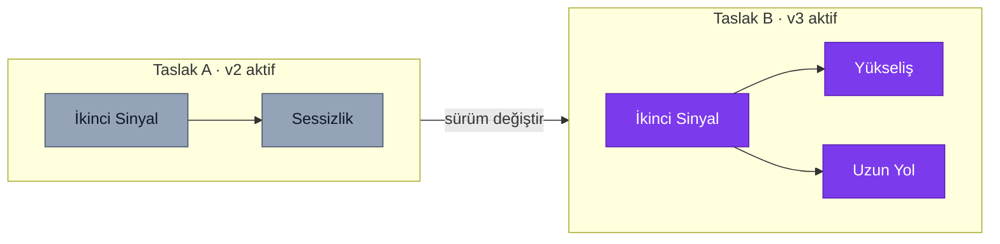
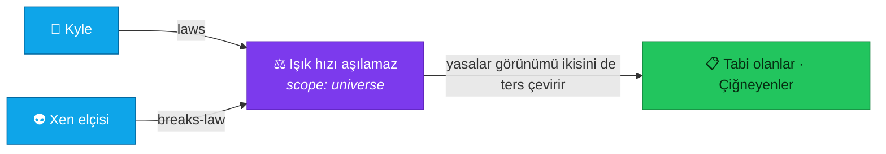
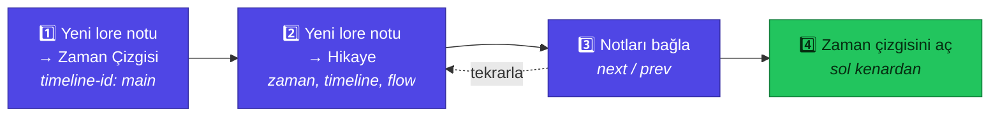

<div align="center">

# 🌌 Lore Creator

### Obsidian içinde kurgu evrenleri kur
#### Dallanan zaman çizgileri · sürümlenen taslaklar · kendi takvimin

[English](README.md) &nbsp;·&nbsp; **Türkçe**

<br/>

[](https://obsidian.md)
[](https://github.com/PancstaR/lore-creator/releases/latest)
[](https://obsidian.md)
[](#️-ayarlar)
[](LICENSE)

<br/>

[**✨ Özellikler**](#-özellikler) &nbsp;·&nbsp;
[**🧩 Kavramlar**](#-kavramlar) &nbsp;·&nbsp;
[**🚀 Başlangıç**](#-başlangıç) &nbsp;·&nbsp;
[**🏷️ Frontmatter**](#️-notlar-nasıl-tanımlanır) &nbsp;·&nbsp;
[**⌨️ Komutlar**](#️-komutlar) &nbsp;·&nbsp;
[**🛠️ Geliştirme**](#️-geliştirme)

<br/>

> **Durum — erken ama tamam.** Aşağıdaki her özellik çalışıyor.
> 1.0'a kadar arayüzler değişebilir, frontmatter şeması henüz dondurulmadı.

</div>

---

## 💡 Neden

Evren notları nadiren sırayla yazılır. 1. bölümü yazarsın, yarım bırakırsın,
4'e atlarsın, sonra 0'a dönersin. Daha sonra savaşın yirmi yıl önce başlaması
gerektiğine karar verirsin ve sekiz notun birlikte değişmesi gerekir — ama eski
taslağı da saklamak istersin, çünkü henüz emin değilsindir.

Çoğu araç ileriye doğru yazdığını ve fikrini hiç değiştirmediğini varsayar. Bu
eklenti tersini varsayar:

| | |
|---|---|
| 🌱 | **Yarım kalmış olmak normal bir durumdur**, temizlenecek bir hata değil |
| 🌿 | **Bir parça farklı taslaklarda farklı yerlere bağlanabilir** ve taslak değiştirmek zaman çizgisini yeniden şekillendirir |
| 📦 | **Hiçbir şey silinmez.** Eski sürümler ve kullanılmamış fikirler bulabileceğin yerde kalır |

Her şey sıradan Markdown ve sıradan frontmatter içinde durur. Eklentiyi
kaldırırsan evrenin hâlâ okunabilir bir not kümesidir.

---

## 🧩 Kavramlar

Dört fikir, bilinçli olarak ayrı tutulmuş:



| | Kavram | Nedir | Kurgunun parçası mı? |
|---|---|---|---|
| 🕒 | **Zaman çizgisi** | Bir gerçeklik — ana evren ya da paralel bir evren | ✅ Evet |
| 🧵 | **Akış** | Zaman çizgisi içinde bir şerit, genelde bir karakterin hattı. Şeritler kesişir, birleşir, tekrar ayrılır | ✅ Evet |
| 📝 | **Sürüm** | Bir notun taslağı. Kendi zamanını, akışını ve bağlantılarını taşır | ❌ Yazarın aracı |
| 🚦 | **Durum** | `draft` · `partial` · `done` | ❌ Yazarın aracı |

> [!IMPORTANT]
> **Paralel evren bir zaman çizgisidir; aynı sahnenin ikinci denemesi bir
> sürümdür.** Bu ikisini karıştırmak, bir vault'u tutarsız hale getirmenin en
> hızlı yoludur.

---

## ✨ Özellikler

| | | |
|---|---|---|
| 🌿 | **Dallanan tuval** | Yatayda zaman, dikeyde akış şeritleri, `next`/`prev` eğri çizgilerle |
| 📝 | **Hikayeyi yeniden şekillendiren sürümler** | Her taslak kendi zamanını, akışını ve bağlantılarını taşır |
| 📚 | **Sürüm setleri** | Bütün bir kurgu revizyonunu tek hamlede ileri geri çevir |
| 📅 | **Kendi takvimin** | İstediğin birim, istediğin sıfır noktası, isteğe bağlı Dünya karşılığı |
| 🗂️ | **Türler ve varlıklar** | Karakter, tür, mekân, fraksiyon, nesne, olay — kodda değil, bir notta tanımlı |
| ⚖️ | **Yasalar** | Evren fiziği ve onu çiğneyen varlıklar, iki yönlü bağlı |
| 💡 | **Terfi edilebilen taslaklar** | Yeri olmayan fikirler için raf; hak ettiğinde gerçek nota dönüşür |
| 🧭 | **Gezinme** | Her notun altında nereye bağlandığını gösteren çubuk ve önizleme haritası |
| 📊 | **Pano ve tutarlılık** | Sayılar, yarım kalan her şey ve uyarı amaçlı rapor |
| 🔍 | **Arama ve dışa aktarma** | Alanlara göre süz, seçtiklerinden tek Markdown dokümanı üret |

### 🌿 Dallanan zaman çizgisi tuvali

Zaman çizgisi kimliği taşıyan notlar, yatayda zamana, dikeyde akış şeritlerine
göre yerleştirilir. Bağlantılar `next` ve `prev` alanlarından gelir; kesişen
hatlar okunaklı kalsın diye eğri çizilir.



<div align="center"><sub>🟩 done &nbsp;·&nbsp; 🟨 partial &nbsp;·&nbsp; ⬜ draft &nbsp;·&nbsp; kesikli = belirsiz zaman</sub></div>

- Kutular süreyi göstermek için genişler (`time-end`), yaklaşıksa kesikli
  çizilir (`time-uncertain`).
- **Henüz zamanı olmayan** notlar kaybolmaz, kendi şeritlerine yerleşir.
- Kenar rengi durumu gösterir; başka sürümü olan parçalarda bir nokta belirir.
- Kaydır, yakınlaştır, herhangi bir nota tıklayıp geç.

### 📝 Hikayeyi yeniden şekillendiren sürümler

Bir notun her sürümü metnini **ve** zamanını, akışını, bağlantılarını birlikte
taşır. Bir taslakta sahne bir savaşa bağlanır, başka bir taslakta bambaşka bir
yere. Sürümü değiştir, zaman çizgisi yeniden çizilir.



Aktif sürüm her zaman notun kendi yolunda durur; böylece vault'un başka
yerlerindeki `[[bağlantılar]]` hiç kırılmaz. Eski sürümler bir arşiv klasöründe
bekler ve gerçekle uyuşmayı bırakabilecek bir liste yerine `version-of` bağı
takip edilerek bulunur.

**📚 Sürüm setleri**, hangi notun hangi sürümünün aktif olduğunun isimli anlık
görüntüsünü tutar. Bir kurgu revizyonu genelde birçok notu birden etkiler;
bunlar olmasa eski taslağa dönmek, hepsini tek tek hatırlayıp çevirmek demektir.

> [!NOTE]
> Dosya taşıyan her işlemin önünde, ilgili yolları tek tek yazan bir onay
> penceresi vardır; sıralama, mevcut içerik yeni yerine ulaşmadan hiçbir şeyin
> üzerine yazılmayacak şekilde kurulmuştur.

### 📅 Kendi takvimin

Bir evren Dünya yıllarıyla işlemek zorunda değildir.

```yaml
time: 134923.4521          # her zaman tek bir sıralanabilir sayı
time-precision: date       # year · date · datetime
time-label: "Xen Yılı 134923, 165. gün"
earth-time: 2050           # okuyucu için isteğe bağlı referans
```

Takvimi bir kere tanımla — birim adı, sıfır noktası, birim başına gün ve Dünya
yıllarına nasıl karşılık geldiği — zaman seçici sayıyı ve etiketi senin yerine
doldursun. Ya da karşılığı hiç tanımlama, etiketi kendin yaz.

### 🗂️ Türler ve varlıklar

Karakter, tür, mekân, fraksiyon, nesne, olay, yasa, taslak. Her türün kendi
alanları, kendi şablonu ve kendi varsayılan simgesi var.

Tür kaydı bir notun frontmatter'ında durur; yani **yeni tür eklemek bir notu
düzenlemektir, bu eklentiyi düzenlemek değil** — ve vault'unu okuyan herhangi
bir yapay zekâ, türlerinin ne anlama geldiğini görebilir.

### ⚖️ Kimin çiğnediğini bilen yasalar

Evren geneli fizik ve varlığa özel kurallar, iki katman halinde. Varlıklar hangi
yasalara tabi olduklarını ve hangilerini çiğnediklerini bildirir; yasalar
görünümü bu bağları ters çevirerek yasanın altında ikisini birden gösterir.
Yasalar belirli zaman çizgileriyle sınırlandırılabilir — paralel bir gerçeklik
farklı fizikle işliyorsa.



### 💡 Terfi edilebilen taslaklar

Henüz yeri olmayan fikirler için bir raf. Yazdığın notun yanında açıp yerini
kaybetmeden bakabilirsin. Bir fikir hikayede yerini hak ettiğinde terfi ettir:
türünü ve klasörünü seç, taslağın metnini kendinde mi tutacağını yoksa
devredeceğini mi belirle. Her iki durumda da taslak yaşamaya devam eder ve iki
not birbirini gösterir.

### 🧭 Gezinme

Her notun altında nereye bağlandığını gösteren bir çubuk. Parçalar çoğu zaman
birden fazla yere bağlanır, o yüzden her hedefin kendi düğmesi olur. Üzerine
gelince hedef, tüm zaman çizgisini ya da sadece bir adım ötesini gösterebilen
bir haritada belirir — harita sabitlenebilir.

Boş bir `next` alanı, hattın orada bittiği anlamına gelir. Yerini doldurmak için
hiçbir şey uydurulmaz.

### 📊 Pano, arama ve dışa aktarma

| | | |
|---|---|---|
| 📊 | **Pano** | Türe göre sayılar, yarım kalan her şey (yarısı yazılmışlar dokunulmamışların üstünde) ve tutarlılık raporu |
| 🩺 | **Tutarlılık** | Kırık bağlantılar, tek taraflı bağlar, zamanca geriye giden bağlantılar, zaman çizgisinde olup tarihi olmayan notlar. **Sadece uyarı amaçlı:** hiçbir şeyi düzeltmez, hiçbir işlemi engellemez; çünkü bulguların çoğu hata değil, devam eden iştir |
| 🔍 | **Arama** | Türe, duruma, zaman çizgisine, akışa ve zaman aralığına göre süzer. Obsidian'ın kendi araması kelimeleri zaten buluyor; bu, *"ana evrende yarım kalmış tüm karakterler"* sorusunu cevaplıyor |
| 📤 | **Dışa aktarma** | Seçtiğin bölümlerden tek bir Markdown dokümanı. Notlarda gizlilik bayrağının olmamasının sebebi budur: okuyucunun ne göreceği paylaşırken belirlenir, her notta sonsuza kadar saklanmaz |

---

## 🚀 Başlangıç

### 📥 Kurulum

Henüz topluluk eklenti listesinde değil. O zamana kadar:

1. [Son sürümden](https://github.com/PancstaR/lore-creator/releases/latest)
   `main.js`, `manifest.json` ve `styles.css` dosyalarını indir.
2. `<vault>/.obsidian/plugins/lore-creator/` klasörüne koy.
3. Obsidian'da: **Ayarlar → Topluluk eklentileri**, kısıtlı modu kapat, sonra
   *Lore Creator*'ı etkinleştir.

### 🪄 Bir vault kur

Komut paletinden **Bu vault'u kur** komutunu çalıştır. Görünümlerin okuduğu
klasörleri, şablonları ve tür kaydını oluşturur — önce oluşturacağı ağacı
gösterir ve var olan bir dosyanın üzerine asla yazmaz.

```
📁 <vault>
├── 📄 Universe.md            ← takvim, zaman çizgileri, evren geneli yasalar
├── 📁 System/
│   ├── 📄 Types.md           ← tür kaydı: eklentiyi değil, bir notu düzenlersin
│   └── 📄 Version sets.md
├── 📁 Templates/
├── 📁 Versions/              ← arşivlenen sürümler, version-of ile bulunur
└── 📁 Exports/
```

Klasör adları arayüz dilinden ayrı seçilir: bir evren, hikayesi hangi dildeyse o
dilde yazılır ve bu, menülerinin dili olmak zorunda değildir.

### ✍️ Bir şeyler yaz



1. **Yeni lore notu** → *Zaman Çizgisi* seç, ad ver, `main` gibi bir
   `timeline-id` gir ve akışlarını listele.
2. **Yeni lore notu** → *Hikaye* seç. Üstteki afişte zamana tıklayıp yerleştir,
   özelliklerden `timeline` ve `flow` alanlarını doldur.
3. Tekrarla, notları `next` ile bağla.
4. Zaman çizgisini sol kenardan aç.

---

## 🏷️ Notlar nasıl tanımlanır

<details open>
<summary><b>Standart alanlar</b> — her lore notunda</summary>

| Alan | Anlamı |
|---|---|
| `type` | Hangi tür olduğu — klasör sadece düzen içindir |
| `icon` / `icon-type` | Bir emoji ya da Lucide ikon adı |
| `status` | `draft` · `partial` · `done` |
| `aliases` | Obsidian'ın kendi alanı; `[[Lord Kyle]]` bağlantısını bu nota çözer |
| `alias-history` | Adın ne zaman ve neden değiştiği |
| `related` | Serbest bağlantılar |

</details>

<details>
<summary><b>🕒 Zaman çizgisi yerleşimi</b> — notun bir yeri varsa</summary>

| Alan | Anlamı |
|---|---|
| `timeline` | Hangi gerçekliğe ait olduğu |
| `flow` | Hangi şerit |
| `time` | Tek bir sayı. Sıralama yalnızca buna bağlıdır. Boş olabilir |
| `time-precision` | `year` · `date` · `datetime` |
| `time-label` | Okuyucunun gördüğü metin |
| `time-end` | Bir ana değil bir döneme yayılıyorsa doldurulur |
| `time-uncertain` | Kesikli çizilir |
| `earth-time` | İsteğe bağlı referans, hesaplanır ya da elle yazılır |
| `next` / `prev` | Bağlantılar. Birden fazlaysa hikaye dallanıyordur |

</details>

<details>
<summary><b>📝 Sürümleme</b></summary>

| Alan | Anlamı |
|---|---|
| `version` | `v1`, `v2`, … |
| `version-name` | İsteğe bağlı ad, arşiv dosya adında da kullanılır |
| `version-note` | Bu taslağın farkı ne |
| `version-of` | Yalnızca arşivlenmiş sürümlerde bulunur |

</details>

<details>
<summary><b>⚖️ Yasalar ve 💡 taslaklar</b></summary>

| Alan | Anlamı |
|---|---|
| `scope` | `universe` ya da `local` |
| `applies-to` / `timeline-scope` | Bir yasanın nerede geçerli olduğu. Boşsa her yerde |
| `laws` / `breaks-law` | Varlıklarda bildirilir; yasalar görünümü bunları ters çevirir |
| `idea-for` | Taslağın ne için bir fikir olduğu |
| `promoted-to` / `promoted-from` | Terfinin bıraktığı iki yönlü bağ |

</details>

---

## ⌨️ Komutlar

| | Komut | Ne yapar |
|---|---|---|
| 🪄 | Bu vault'u kur | Klasörleri, şablonları ve tür kaydını oluşturur |
| 📄 | Yeni lore notu | Bir türün şablonundan not oluşturur |
| 🪟 | Zaman çizgisini / yasaları / taslakları / panoyu aç | Bir görünüm açar |
| 📝 | Bu notun sürümleri | Sürümleri listeler, oluşturur, değiştirir, arşivler |
| 📚 | Sürüm setleri | İsimli anlık görüntüleri yakalar ve uygular |
| 🧭 | Sonraki / önceki parçaya git | Bir bağlantıyı izler; birden fazlaysa sorar |
| 💡 | Bu taslağı terfi et | Bir eskizi gerçek nota dönüştürür |
| 🔍 | Evrende ara | Metne göre değil, alanlara göre arar |
| 📤 | Evreni dışa aktar | Tek bir Markdown dokümanı üretir |

---

## ⚙️ Ayarlar

Her yol değiştirilebilir; aşağıdakiler yalnızca varsayılanlardır:

| Ayar | Varsayılan |
|---|---|
| Evren dosyası | `Universe.md` |
| Tür kaydı | `System/Types.md` |
| Sürümler klasörü | `Versions` |
| Şablonlar klasörü | `Templates` |
| Sürüm setleri dosyası | `System/Version sets.md` |
| Dışa aktarım klasörü | `Exports` |

Takvim ayarları eklenti verisine değil, evren notunun frontmatter'ına yazılır;
böylece bir vault eklenti kurulu olmasa bile kendini tanımlamaya devam eder. Tür
kaydı da aynı sebeple bir notta durur.

Arayüz dili Obsidian'ınkini takip eder ya da elle seçilebilir. **🇬🇧 İngilizce ve
🇹🇷 Türkçe** dahildir. Frontmatter alan adları her dilde İngilizcedir — onlar
veri, arayüz değil.

---

## 🛠️ Geliştirme

```bash
npm install
npm run dev     # esbuild izler — kaydettikçe main.js yeniden üretilir
npm run build   # tip kontrolü, sonra küçültülmüş main.js
```

Kaynaklar herhangi bir vault'un dışında durur. Eklenti üzerinde çalışmak için
bir vault'un eklenti klasörünü bu depoya yönlendir — junction ya da symlink tek
kopya kalmasını sağlar:

```bash
# Windows, yönetici izni gerekmez
mklink /J "<vault>\.obsidian\plugins\lore-creator" "<bu deponun yolu>"

# macOS ve Linux
ln -s "<bu deponun yolu>" "<vault>/.obsidian/plugins/lore-creator"
```

Obsidian eklentileri kendiliğinden yeniden yüklemez.
[Hot Reload](https://github.com/pjeby/hot-reload) yeni derlemeleri otomatik
alır; onsuz her değişiklikten sonra *Reload app without saving* komutunu
çalıştır.

Sürümler, başında `v` olmadan tam olarak sürüm numarasıyla etiketlenir. Etiketi
push etmek eklentiyi derler ve `main.js`, `manifest.json`, `styles.css`
dosyalarını ayrı ayrı varlık olarak yayınlar — Obsidian'ın beklediği budur.

Çalışma zamanı bağımlılığı yoktur; `main.js` içine hiçbir üçüncü parti kod
paketlenmez.

---

## 🤝 Katkı

Sorun bildirimleri ve pull request'ler açıktır. Başlamadan önce bilinmesi
gereken iki şey:

- 🗄️ **Doğrunun kaynağı vault'tur.** Eklentinin bildiği her şey notların
  kendisinden okunabilmelidir ki evren onsuz da ayakta kalsın.
- 🛡️ **Yıkıcı hiçbir işlem onay penceresi olmadan gerçekleşmez**; dosya
  taşımaları da bir hata durumunda boşluk değil kopya bırakacak şekilde
  sıralanmıştır.

---

<div align="center">

**Lore Creator** &nbsp;·&nbsp; **[PancstaR](https://github.com/PancstaR)** &nbsp;·&nbsp; [MIT](LICENSE)

<sub>Fikrini değiştiren yazarlar için ✍️</sub>

</div>
